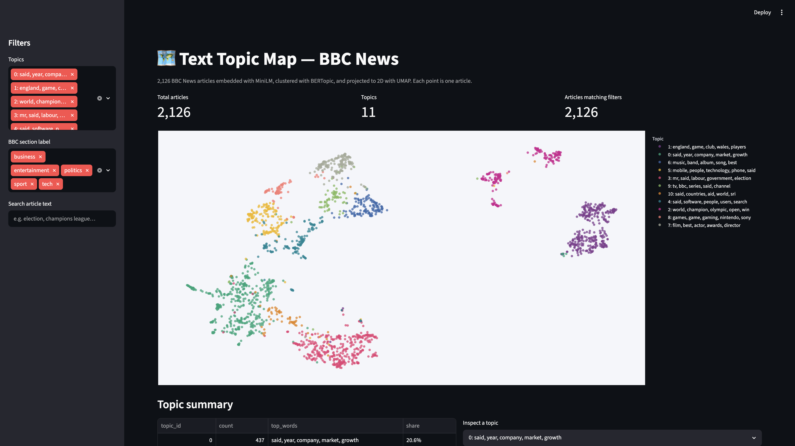

# 🗺️ Text Topic Map — BBC News

Interactive topic map of 2,126 BBC News articles: sentence embeddings → BERTopic clustering → UMAP 2D projection → Streamlit dashboard.

**Live demo:** [Hugging Face Space](HF_SPACE_URL_PLACEHOLDER) · **Code:** [GitHub](https://github.com/DDDD-433/text-topic-map)



## Problem

News archives are easy to search but hard to *see*. Given a few thousand uncategorized articles, how do you get a quick, trustworthy picture of what they cover — which themes dominate, how distinct they are, and where stories blur across desks (e.g. business vs. politics)? This project turns the classic BBC News corpus into an interactive 2D map where semantically similar articles sit next to each other and topics emerge as visible clusters.

## Approach

1. **Data** — [`SetFit/bbc-news`](https://huggingface.co/datasets/SetFit/bbc-news) (train + test splits merged, exact-duplicate texts dropped → 2,126 articles across 5 BBC sections).
2. **Embed** — [`all-MiniLM-L6-v2`](https://huggingface.co/sentence-transformers/all-MiniLM-L6-v2) sentence embeddings (384-dim).
3. **Cluster** — BERTopic on the precomputed embeddings, with HDBSCAN `leaf` selection for finer-grained clusters and a stopword-aware vectorizer for readable topic labels. Outlier documents are reassigned to their nearest topic.
4. **Project** — UMAP to 2D (`x`, `y`) for the scatter map.
5. **Serve** — Streamlit + Plotly dashboard that reads only the precomputed parquet — no model runs at serving time, so the app starts in seconds.

## Results

The pipeline finds **11 topics**, the largest holding only 20.6% of articles. **94.7% of articles land in a topic whose dominant BBC section matches their own label** — strong evidence the embedding space recovers the human editorial structure without ever seeing the labels.

Real findings from this run (seed 42):

1. **Business and politics separate cleanly despite shared vocabulary.** Topic 0 (*company, market, growth* — 97% business) and Topic 3 (*labour, government, election* — 95% politics) form adjacent but distinct clusters; with HDBSCAN's default `eom` selection they collapsed into a single 890-article blob, and switching to `leaf` selection split them.
2. **Sport splits into two well-separated sub-themes.** Team sports (Topic 1: *england, club, wales, players*, 329 docs) and individual athletics/championships (Topic 2: *champion, olympic, open, win*, 187 docs) sit far apart on the map — plus a tiny, tightly-packed doping cluster (*kenteris, iaaf, drugs*) that survives as its own island.
3. **The one genuinely mixed cluster is the 2004 tsunami story.** Topic 10 (*countries, aid, world, sri* — 61 docs) is only 57% business: it blends business coverage of reconstruction costs with politics coverage of aid pledges, a real cross-desk news event rather than a modeling artifact.

## How to run

```bash
git clone https://github.com/DDDD-433/text-topic-map
cd text-topic-map
pip install -r requirements.txt

# 1. Rebuild everything: download data, embed, cluster, project (~2 min on a laptop)
bash scripts/run_pipeline.sh

# 2. Launch the dashboard (uses the committed precomputed parquet, so this
#    also works without running the pipeline first)
bash scripts/run_app.sh
```

## Tech stack

| Layer | Tools |
|---|---|
| Data | Hugging Face `datasets`, pandas, pyarrow |
| NLP | sentence-transformers (MiniLM), BERTopic, HDBSCAN |
| Dimensionality reduction | UMAP |
| Visualization | Plotly, Streamlit |

## Project structure

```text
app/streamlit_app.py        # dashboard (reads precomputed parquet only)
src/config.py               # paths + hyperparameters
src/pipeline.py             # load → clean → embed → cluster → project
scripts/run_pipeline.sh     # one-command rebuild
scripts/run_app.sh          # one-command app launch
data/processed/             # committed artifacts the app serves
assets/                     # screenshot + data summary
```

## Future work

- Add a date dimension (the corpus is 2004–2005) to animate topic drift over time.
- Let users drop in their own CSV of texts and re-map it client-side with a small ONNX encoder.
- Compare BERTopic labels against an LLM-generated topic naming pass.

## Limitations

- UMAP coordinates are for visualization only; distances between far-apart clusters are not meaningful.
- Topic assignments are deterministic for the committed seed but can shift if dependencies change major versions.
